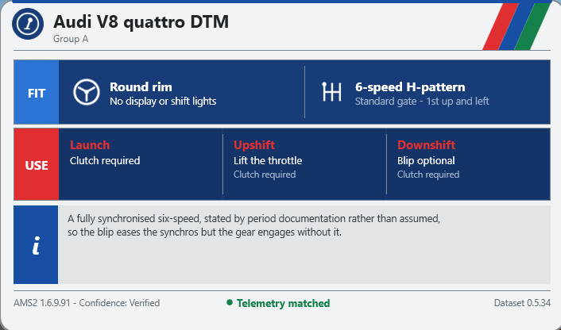
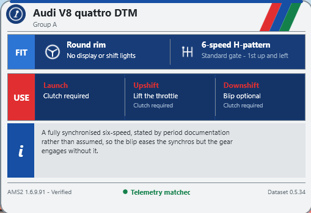
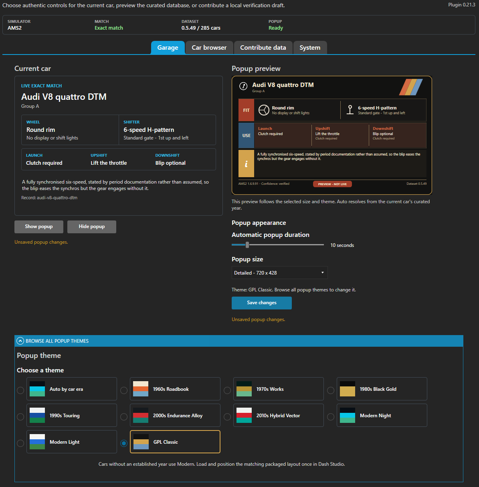
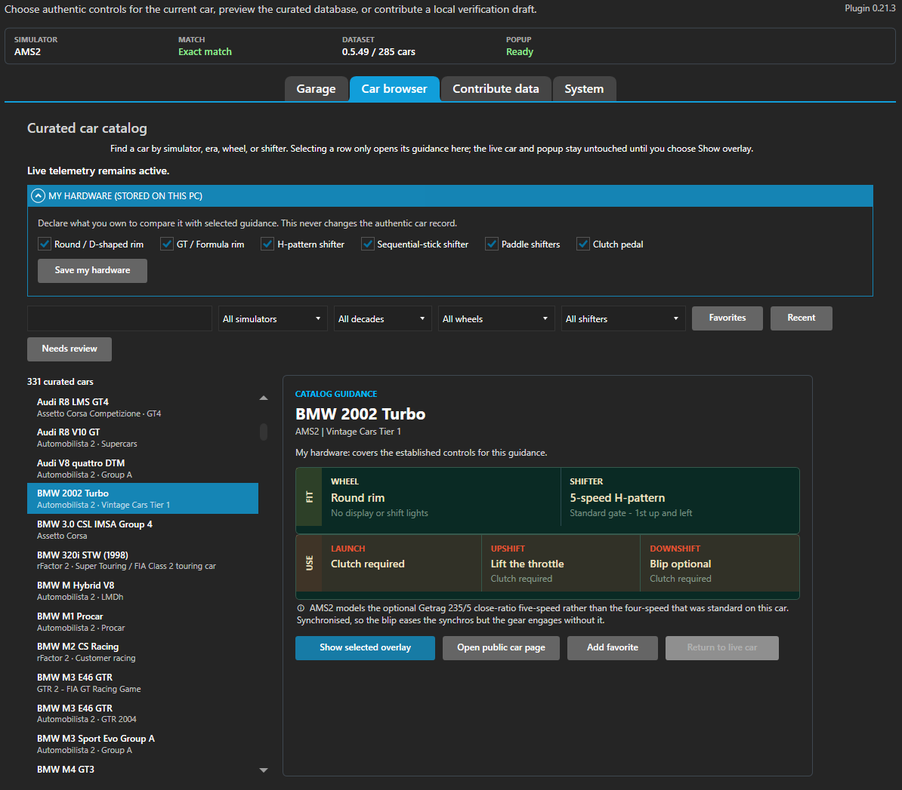
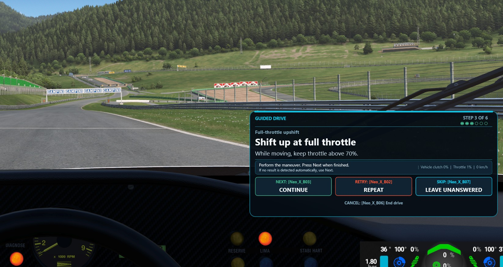

# As Driven

**Which physical controls should I use for this car, and how do I shift it?**

As Driven answers that before you leave the pits. Load a car in a supported
simulator and the overlay tells you what the real car had - the shape of its
wheel, whether it has a clutch pedal and when you actually need it, whether to
lift off the throttle when you upshift, whether to blip on the way down.

It is a database first and a SimHub plugin second. The data is open, versioned,
and simulator-independent; the plugin is one client that reads it.

[Browse the public controls database](https://milky28.github.io/as-driven/),
[contribute a simulator observation](https://github.com/Milky28/as-driven/issues/new?template=simulator-observation.yml),
or [improve an existing car's research](https://github.com/Milky28/as-driven/issues/new?template=existing-car-research.yml).

## New in 0.22.0

- **Guidance where the real car was never researched.** A large part of any
  controls database is simply not published: gearbox architecture is easy to
  source, launch and shift technique almost never is. Rather than answer "not
  established" and stop, As Driven can now say how cars of that mechanism were
  usually driven - marked as convention, never as a finding about your car. The
  first reviewed rule covers H-pattern cars whose gearbox construction is
  unknown, and reaches 84 open fields across 42 cars.
- **It is kept apart from evidence, deliberately.** The line says the real
  value is not established before it says what such cars usually did, it is
  drawn in its own colour on the card and under its own heading in the catalog,
  and it can neither change nor replace a value a record establishes. A car
  that answers for itself is never spoken for.
- **Three more cars sourced from the real car.** The gearbox architecture of
  the McLaren F1 GTR Longtail, Cadillac DPi-V.R and Chevrolet Camaro GT4.R now
  rests on published accounts of those cars rather than on one guided drive.
- **Better evidence behind the DBR9 and the C9.** A period road test, an
  exact-chassis interview and Aston Martin's own specification stand behind the
  DBR9's clutch and cockpit rim; Daimler-credited photographs stand behind the
  C9's rim. The answers do not change - what holds them up does.

Download it from the
[latest published release](https://github.com/Milky28/as-driven/releases/latest).
The car and simulator totals are in the table below.

## What it tells you

A round rim with no display, a six-speed H-pattern on a standard gate, and the
technique that goes with it: clutch to pull away, lift on the upshift, blip
optional on the way down. The note says why the blip is optional rather than
required, and the footer records which game version the observation came from.

The same card comes in a compact size:

Each field is drawn from a fixed vocabulary:

<table>
<tr>
<td align="center"></td>
<td align="center"></td>
<td align="center"></td>
<td align="center"></td>
</tr>
<tr>
<td align="center"><b>Round rim</b> so you fit the right one first</td>
<td align="center"><b>GT or formula rim</b> and whether it has a display</td>
<td align="center"><b>D-shaped, open top</b> open-top is recorded separately</td>
<td align="center"><b>Shift pattern</b> H-pattern, and how many gears</td>
</tr>
<tr>
<td align="center"></td>
<td align="center"></td>
<td align="center"></td>
<td align="center"></td>
</tr>
<tr>
<td align="center"><b>Dogleg</b> first is down, not up</td>
<td align="center"><b>Sequential</b> a stick, or paddles</td>
<td align="center"><b>Clutch</b> for starts, upshifts, downshifts</td>
<td align="center"><b>Throttle</b> lift on upshift, blip on downshift</td>
</tr>
</table>

## In the plugin

The Garage tab mirrors the live car and previews the popup. Choose its size,
theme, and duration, then save your changes. Themes can follow the car's era or
use your chosen style:

The car browser reads the whole curated database offline, without starting a
simulator, and filters by simulator, era, wheel, or shifter. Save your hardware
to compare it with a car's guidance, revisit Favorites and Recent cars, or open
the selected car's public controls page. Browsing leaves the live car and popup
alone until you choose **Show selected overlay**:

## Install

1. Download the newest `As-Driven-for-SimHub-*.zip` from
   [Releases](https://github.com/Milky28/as-driven/releases).
2. Close SimHub and extract the ZIP.
3. Double-click **Install As Driven.cmd** and approve the Windows prompt.
4. Start SimHub, enable **As Driven** under Settings > Plugins.
5. Load the As Driven overlay in Dash Studio.

Updating can use the System tab's manual check and its opt-in **Download and
install** action, or the same manual procedure as installation. Your settings,
layouts, and contribution drafts are preserved, and every release carries the
current car data with it.

Full details, checksum verification, rollback, and removal are in
[docs/install.md](docs/install.md).

The plugin works offline. It has no analytics, no account, and no background
update check. **Check for updates** contacts the update service only when you
press it and does not download a package. If it finds one, **Download and
install** appears and requires a separate confirmation before downloading; the
package is SHA-256 verified, installation waits for you to close SimHub, and
Windows still asks for administrator approval. Opening a public car page or
contribution form launches your browser; contribution drafts stay local until
you choose to share them. See [PRIVACY.md](PRIVACY.md).

## What it covers

<!-- release-facts:start -->
Dataset 0.6.0 contains 300 reviewed car records.

| Simulator | Records | Also curated for AMS2 |
| --- | --- | --- |
| Automobilista 2 | 262 | not applicable |
| Project Motor Racing | 32 | 15 |
| Assetto Corsa | 21 | 14 |
| Assetto Corsa Competizione | 18 | 18 |
| RaceRoom Racing Experience | 10 | 3 |
| Assetto Corsa EVO | 7 | 3 |
| rFactor 2 | 5 | 0 |
| GTR 2 | 2 | 2 |
<!-- release-facts:end -->

Coverage is deepest in Automobilista 2, which is where the work started. The
other simulators carry reviewed entries rather than complete rosters. A car can
be reviewed in more than one simulator, so the simulator counts overlap.

Matching is exact and case-sensitive. A car the database has not reviewed is
reported as unmatched rather than given a guess, because a confident wrong
answer about a clutch is worse than no answer.

Tested against SimHub 9.12.6 and Automobilista 2 1.6.9.91 on Windows. Newer
versions generally work; they have not been verified.

## Why the data is trustworthy

Most car databases give you a value. This one also tells you where the value
came from and how sure it is, and it keeps three different questions apart:

| Layer | Question |
| --- | --- |
| `authentic_controls` | What did the **real car** have? |
| `simulators[].behavior` | What does **this simulator** actually do? |
| `simulators[].overrides` | Where the two differ, and the evidence for it |

Two rules follow from that, and they matter more than the record count:

- **`unknown` is not `no`.** A blank in a source means nobody established the
  answer. Converting that to "no clutch needed" invents a fact, so the database
  keeps it blank and the overlay says so.
- **Every material claim cites a source**, with a confidence level and a
  falsifiable basis. Simulator observations record the exact game version and
  the date they were checked, because a game update can silently change them.

Primary sources - manufacturer manuals, homologation documents, simulator
documentation - are preferred. Search snippets, unattributed reposts, and
AI-generated claims are not acceptable evidence.

## Scope

The database answers a narrow pre-session question. It covers the wheel rim,
shifter actuation and gear count, unusual patterns such as dogleg, clutch use,
throttle lift, shift cut, and blipping. Steering lock is optional reference
metadata, since most wheelbases apply it automatically.

General vehicle specifications, driver aids and electronics, and handbrake
construction are deliberately out of scope. It is not a car encyclopedia.

## Contributing

If a car is missing or looks wrong, the plugin can walk you through a guided
drive that produces a structured draft - **Contribute a simulator observation**
in the plugin's settings. It prompts one test at a time in the car and records
what the simulator actually did:

The overlay shows your current step and mapped buttons for continuing, retrying,
skipping, or ending the drive. The workflow supports Project Motor Racing and
GTR2 alongside the other registered simulators. You can also
[propose a correction to an existing car](https://github.com/Milky28/as-driven/issues/new?template=existing-car-research.yml)
without recording another drive.

Nothing is uploaded automatically; the draft stays on your PC until you choose to
attach it to a submission.

A maintainer reviews and approves every contribution before it enters a release.
See [CONTRIBUTING.md](CONTRIBUTING.md).

## Documentation

| For | Read |
| --- | --- |
| Installing, updating, removing | [docs/install.md](docs/install.md) |
| Contributing data | [CONTRIBUTING.md](CONTRIBUTING.md) |
| Privacy and networking | [PRIVACY.md](PRIVACY.md) |
| Working on the project | [docs/development.md](docs/development.md) |
| Field semantics and identity rules | [docs/data-model.md](docs/data-model.md) |
| Version history | [CHANGELOG.md](CHANGELOG.md) |

## Licensing

Software is MIT licensed. The original database selection and arrangement is
CC BY 4.0; third-party sources retain their own rights. See
[LICENSE](LICENSE) and [DATA_LICENSE.md](DATA_LICENSE.md).
